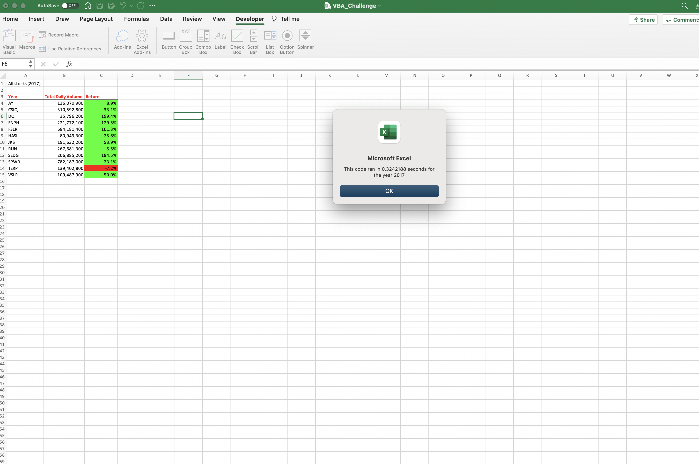
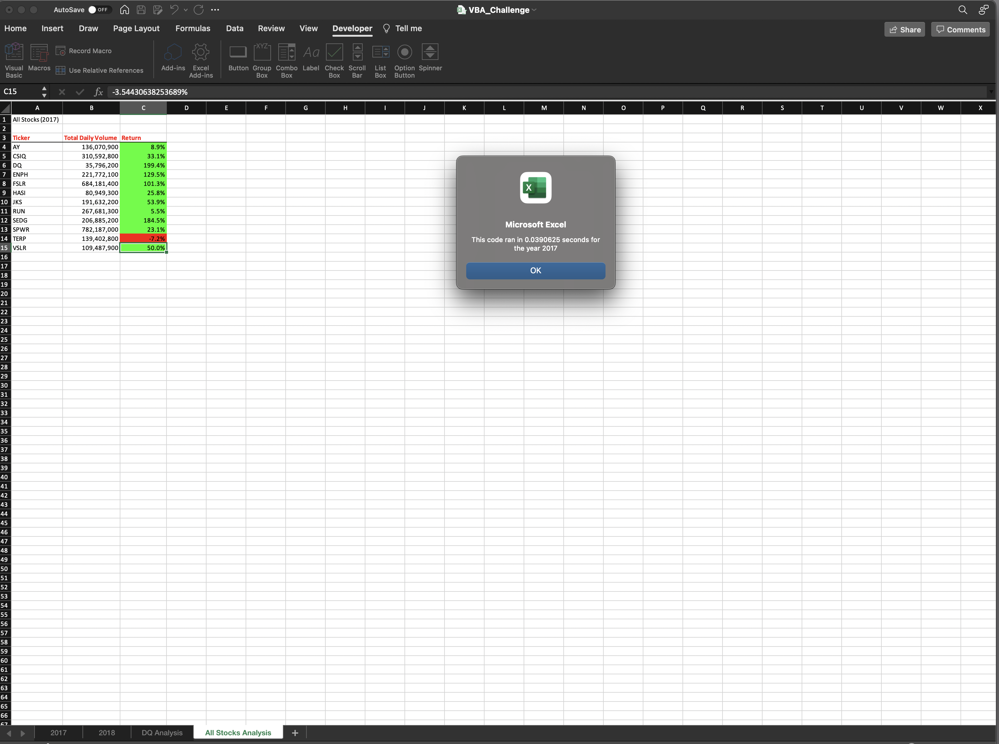
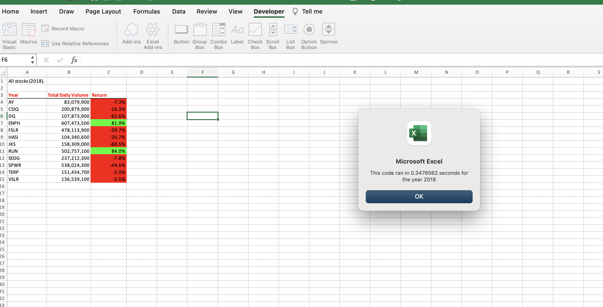

# Stock-Analysis
# VBA of Wall Street

## Overview of Project

### Purpose

The purpose of this project is to take the current code that has been written to loop through the data, and refactor it. The goal of refactoring this code is to make the overall code and looping of the data more efficient, by minimizing the steps taken to loop, reducing memory usage, and potentially improving the overall logic code to make it easier to understand and read for future readers. 

## Results

###Analysis

As state in the purpose of the project, this code was refactored in order to make the code more efficient, use less memory, and potentially quicker. , the overall run time of the code to execute was about .324 seconds. When comparing this to the , with an execution time 0.039 seconds, we can see that the refactored code ran significantly faster, then before it was refactored.

 The efficiency was also greatly improved when getting the results for the stock analysis when ran for 2018. , the execution time to perform the analysis of the code was around 0.348 seconds. When compared to the 
, with an execution time of 0.047, we also see a noticeable improvement in the time it took to execute the analysis of the data. 

###Stock performance comparison between 2017 and 2018

When comparing stock performance for the years 2017 and 2018, there is a year in which a majority of the stocks seemed to have been in a bullish market. In 2017, all stocks with the exception of TERP were in the green. All stocks evaluated, with the exception of AY and RUN, had over a 30% return, with some stocks seeing close to a 200% return.

The 2018 year seems to have been more of a bear market, with six stocks falling by close to 20% or more. Two stocks, ENPH and RUN continued on their bear run from the previous year, with both stocks having over 80% return.

###Execution times of scripts
As mentioned in the analysis above, the execution time the code for 2017 before refactoring was 0.324. Post refactoring, the execution time was 0.039 over a 700% in improvement, in regards to execution time.

The 2018 code, also has a significant improvement in execution time, with the original code running at 0.348 seconds, and the refactored code running at .047, a 640% improvement in performance. 

##Summary

###Advantages of refactoring
There are few advantages to refactoring that I have noticed when working on this project. The first is after going through the refactored code, it is easier to understand. The code’s overall design does seem significantly cleaner. The previous code also utilized logical operators, with some “and” statements, which the refactored code no longer utilizes. 

###Disadvantages of refactoring
The first disadvantage of refactoring would have to be the difficulty of it. This code was the first code I have ever refactored. Throughout the refactoring process, I continuously ran into several different errors in the code, some caused by logical operators that were no longer needed, others by simple oversight. 

For someone who has little to no experience in refactoring, I believe it could prove to be quite the challenge, especially when having a code that already works.

###How do the pros and cons apply to refactoring this VBA script?
The first thought that came into my mind when beginning the challenge for this VBA script was, “why change something that works.” Throughout my process refactoring this VBA script, this thought continued to pop into my mind. It was very frustrating changing the code, and continuously getting a variety of different error codes, when the code has previously run effectively, a major disadvantage when it comes to refactoring, in my opinion.

However, once I had successfully refactored the code, and gone back to make sure I understood everything that was happening, and why logical operators were no longer necessary, I saw how much cleaner the code looked, and why it was more efficient, with less steps, and the overall appearance of the code was much cleaner.

Logical operators

